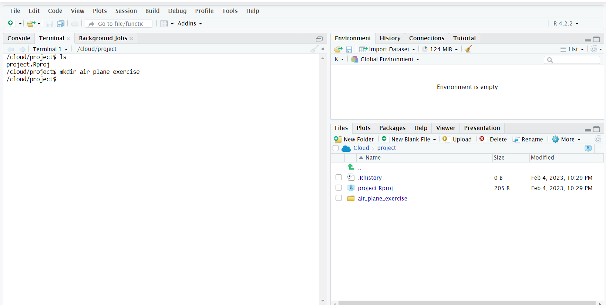
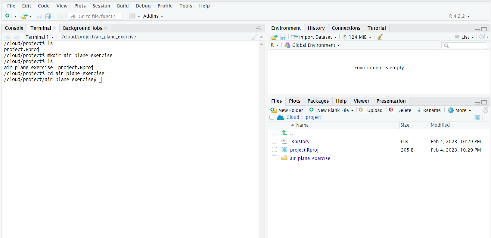
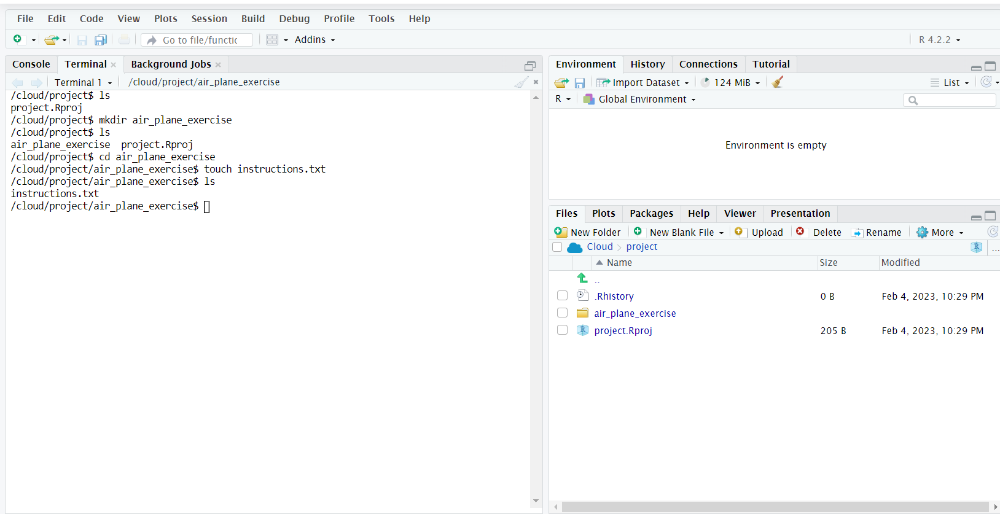
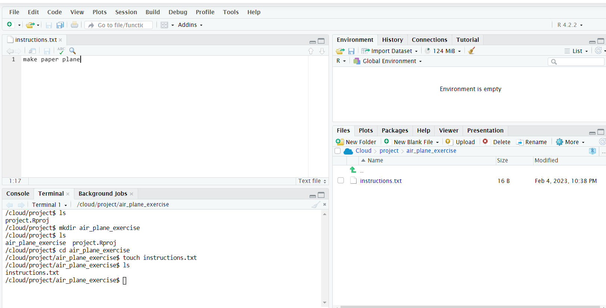
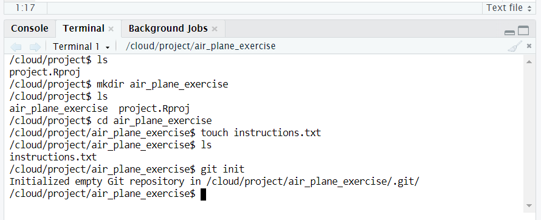

## Overview

In this exercise, we will practice basic Linux command lines, including `ls`, `cd`, `mkdir`, `touch`and basic git commands including `git status`, `git add`, `git commit`, and `git log`.

## Step 1

Goal of this step: get familiar with basic Linux command lines: `ls`, `cd`, `mkdir`and `touch`.

Log in to the  R studio. The interface is shown like below. 

Type `ls` in the terminal. It will list the files and directories in a specified directory or the current working directory if no directory is specified.

Type `mkdir air_plane_exercise` in the terminal.  It will create a new directory with a specified name in the file system.

Type `ls` in the terminal to check the files and directories in current working directory.

Type `cd air_plane_exercise` in the terminal to change the current working directory to `air_plane_exercise` folder.

Type `touch instructions.txt` in the terminal to create a new text file named "instructions" inside the air_plane_exercise folder.  You can type `ls` to check the updated files and folders. 

Now go to the files explorer, double click the "air_plane_exercise" folder and then enter the "instructions.txt". Enter something in the text editor. Save the file. 

## Step 2

Goal of this step: learn git init, git status, git add, and git commit

Type `git init` in the terminal.  The `git init` command is typically used to start a new repository or to convert an existing project into a Git repository.

Make some changes in the "instructions.txt" and save it.

Type `git status` in the terminal to show the state of the working directory and the staged changes. You will see `untracked files`.

Type `git add` in the terminal to stage changes for a commit. It allows you to select which changes in the working directory will be included in the next commit.

Type `git status` in the terminal, you will see "changes to be committed"

Type `git commit -m "paper plane2"`to save changes to the local repository. It takes all of the changes staged with `git add` and stores them as a new commit with a message describing the changes.

Type `git status` to check status again. It should show "nothing to commit, working tree clean".

Make some changes:

- edit the "instructions" text file, save it, git add it, git commit it
- create another text file named "license", save it, git add it, git commit it

## Step 3

Goal of this step: learn git log

Type git log in the terminal to display the commit history. It will show a list of all commits in the current branch, along with information about the author, date, and commit message for each one.

The latest message will show at the top and the oldest will show at the bottom.  

You can also use `git log --oneline --abbrev-commit --all --graph` to show git log in short. 

 

Here are the review of Linux command lines and Git command lines

## Linux Command Lines

1. cd

   `cd` (change directory) is to change the current working directory to a specified directory.

2. ls

   `ls` (list directory contents) is to list the files and directories in a specified directory or the current working directory if no directory is specified.

3. mkdir 

   `mkdir` (make directory) is to create a new directory with a specified name in the file system.

## Git 

1. Git add

   `git add` is a command used in Git to stage changes for a commit. It allows you to select which changes in the working directory will be included in the next commit.

2. Git commit -m "message"

   `git commit` saves changes to the local repository. It takes all of the changes staged with `git add` and stores them as a new commit with a message describing the changes.

3. Git status

   `git status` shows the state of the working directory and the staged changes, and it indicates which branch you are currently on.

4. Git log

   `git log` is to display the commit history of a repository. It shows a list of all commits in the current branch, along with information about the author, date, and commit message for each one.
